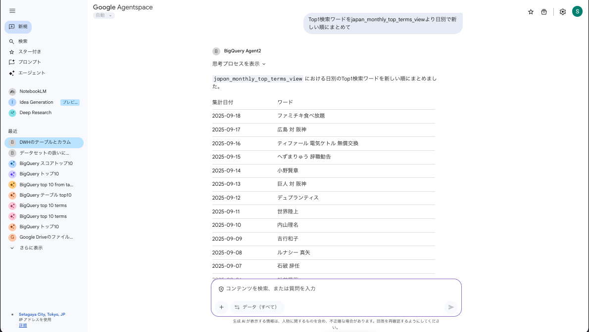

# ADKエージェントとBigQuery認証 - デプロイガイド

このガイドは、Agentspace内でOAuth 2.0認証を利用してユーザーのGoogle Cloudプロジェクト内のBigQueryにアクセスできるADKエージェントを構築、デプロイ、登録するためのステップバイステップの手順を説明します。

> [!WARNING]
> **免責事項**
>
> 本書に記載のコードおよび手順は、あくまで開発の参考として提供するものです。
> ご利用の際は、ご自身の環境で十分にテストを実施し、自己の責任においてご活用ください。

---



---

## 前提条件

- Google Cloud SDK (`gcloud`) がインストールされ、認証済みであること。
- Python 3.10+ および `pip` がインストール済みであること。
- Agentspaceが有効なGoogle Cloudプロジェクトが準備されていること
- BigQuery APIが有効になっており、データセット、テーブル、データが設定済みのGoogle Cloudプロジェクトが準備されていること
- Python環境にGoogle ADK CLIがインストール済みであること。

---

## ステップ1: Google Cloud OAuthの設定

まず、アプリケーション用のOAuth認証情報を作成します。

1.  **OAuthクライアントIDの作成:**
    - Cloudコンソールの[認証情報ページ](https://console.cloud.google.com/apis/credentials)に移動します。
    - **+ 認証情報を作成** > **OAuthクライアントID** をクリックします。
    - アプリケーションの種類として **ウェブアプリケーション** を選択します。
    - **承認済みのリダイレクトURI** の下にある **+ URIを追加** をクリックし、以下の値を正確に入力します。
      ```
      https://vertexaisearch.cloud.google.com/oauth-redirect
      ```
    - **作成** をクリックします。
    - 生成された **クライアントID** と **クライアントシークレット** をコピーしておきます。後で必要になります。

---

## ステップ2: エージェントプロジェクトの構築

### 1. プロジェクトのクローンとセットアップ
まず、GitHubからプロジェクトをクローンし、ディレクトリに移動します。
```bash
git clone git@github.com:shun99/agentspace-adk-bigquery.git
cd agentspace-adk-bigquery
```
次に、プロジェクト専用のPython仮想環境を作成し、有効化します。高速な`uv`の使用を推奨します。
```bash
# uvで仮想環境を作成
uv venv

# 仮想環境を有効化 (macOS/Linuxの場合)
source .venv/bin/activate
```
最後に、`requirements.txt`ファイルを使用して、必要なライブラリをインストールします。
```bash
# 必要なライブラリをインストール
uv pip install -r requirements.txt
```

### 2. プロジェクトのファイル構造
クローンしたプロジェクトは以下のファイル構造になっています。
```
.
├── bigquery_agent/
│   ├── __init__.py         # モジュールとして認識させる
│   ├── agent.py            # エージェント本体の定義
│   └── .env                # 環境変数ファイル(次のステップで作成します)
├── deploy.py               # デプロイ処理のみを担当するスクリプト
└── requirements.txt        # プロジェクトの依存関係ファイル
```
`agent.py`と`deploy.py`には、エージェントのロジックとデプロイスクリプトがそれぞれ含まれています。

### 3. 環境変数の設定 (`.env`)
`bigquery_agent/.env` ファイルを編集し、ご自身のGoogle Cloudプロジェクト情報を記述します。`BIGQUERY_PROJECT_ID`には、クエリ対象のデータが格納されているプロジェクトIDを設定してください。

```dotenv
# Agentspaceが有効なGoogle Cloudプロジェクト
GOOGLE_CLOUD_PROJECT="<YOUR_PROJECT_ID>"
GOOGLE_CLOUD_LOCATION="us-central1"
STAGING_BUCKET="<YOUR_STAGING_BUCKET_NAME>"
GOOGLE_GENAI_USE_VERTEXAI="True"

# クエリ対象のBigQueryプロジェクト
BIGQUERY_PROJECT_ID="<YOUR_BIGQUERY_PROJECT_ID>"
```

---

## ステップ3: ローカルでの動作確認

デプロイとローカルテストのために、ローカル環境に正しい権限を設定します。

1.  **スコープ付きでログイン:** このコマンドを実行し、ユーザー認証情報に必要なAPIスコープを付与します。ブラウザウィンドウが開き、承認を求められます。
    ```bash
    gcloud auth application-default login --scopes='openid,https://www.googleapis.com/auth/bigquery,https://www.googleapis.com/auth/userinfo.email,https://www.googleapis.com/auth/cloud-platform'
    ```

2.  **Quotaプロジェクトの設定:** このコマンドは、APIの課金と割り当てに使用するプロジェクトを指定します。ユーザー認証情報を使用する際に必要です。
    ```bash
    gcloud auth application-default set-quota-project <YOUR_PROJECT_ID>
    ```

3.  **adk webによる動作確認:**
`adk web`コマンドを使用して、ローカル環境でエージェントの動作をテストします。`adk`はプロジェクトのルートから`bigquery_agent`モジュールを自動的に見つけます。

    ```bash
    # 仮想環境を有効化した状態で実行
    adk web
    ```
ブラウザで `http://localhost:8000` を開き、`bigquery_agent` を選択して対話を開始します。

---

## ステップ4: Agentspace認可リソースの作成

OAuth認証情報をAgentspaceに登録します。エージェント登録ごとに、一意の認可リソースが必要です。

-   以下の環境変数を設定し、`curl`コマンドを実行してOAuth認証情報をAgentspaceに登録します。`<...>`の部分はご自身の値に置き換えてください。

```bash
export ACCESS_TOKEN=$(gcloud auth print-access-token)
export PROJECT_ID="<YOUR_PROJECT_ID>"
export AUTH_ID="bigquery-auth"
export OAUTH_CLIENT_ID="<YOUR_CLIENT_ID_FROM_STEP_1>"
export OAUTH_CLIENT_SECRET="<YOUR_CLIENT_SECRET_FROM_STEP_1>"
export REQUIRED_SCOPE="https://www.googleapis.com/auth/cloud-platform"
export OAUTH_AUTH_URI="https://accounts.google.com/o/oauth2/auth?client_id=$OAUTH_CLIENT_ID&response_type=code&access_type=offline&prompt=consent"
export OAUTH_TOKEN_URI="https://oauth2.googleapis.com/token"


curl -X POST \
  -H "Authorization: Bearer $ACCESS_TOKEN" \
  -H "Content-Type: application/json" \
  -H "X-Goog-User-Project: $PROJECT_ID" \
  "https://discoveryengine.googleapis.com/v1alpha/projects/$PROJECT_ID/locations/global/authorizations?authorizationId=$AUTH_ID" \
  -d '{
    "name": "projects/'$PROJECT_ID'/locations/global/authorizations/'$AUTH_ID'",
    "serverSideOauth2": {
    "clientId": "'"$OAUTH_CLIENT_ID"'",
    "clientSecret": "'"$OAUTH_CLIENT_SECRET"'",
    "authorizationUri": "'"$OAUTH_AUTH_URI"'",
    "tokenUri": "'"$OAUTH_TOKEN_URI"'",
    "scopes": ["'"$REQUIRED_SCOPE"'"] 
    }
  }'
```

---

## ステップ5: エージェントのデプロイ

作成したデプロイスクリプトを実行して、エージェントをVertex AI Agent Engineにデプロイします。

```bash
python deploy.py
```
デプロイが完了すると、スクリプトの最後に `ADK_DEPLOYMENT_ID` が表示されます。次のステップで使用するため、このIDをコピーしておきます。

---

## ステップ6: Agentspaceへのエージェント登録

最後に、デプロイしたエージェントをAgentspaceアプリに登録します。

-   以下の環境変数を設定し、`curl`コマンドを実行します。`<...>`の部分はご自身の値に置き換えてください。

```bash
export ACCESS_TOKEN=$(gcloud auth print-access-token)
export PROJECT_ID="<YOUR_PROJECT_ID>" # Agentspaceが有効なGoogle CloudプロジェクトのID
export APP_ID="<YOUR_AGENTSPACE_APP_ID>" # AgentspaceアプリのID
export ADK_DEPLOYMENT_ID="<ID_FROM_STEP_5>" # ステップ6で作成した認可リソースのID
export AUTH_ID="bigquery-auth" # ステップ4で作成した認可リソースのID
export AUTH_PROJECT_ID="<YOUR_AUTH_PROJECT_NUMBER>" # OAuthクライアントを作成したプロジェクトのプロジェクト番号

curl -X POST \
  -H "Authorization: Bearer $ACCESS_TOKEN" \
  -H "Content-Type: application/json" \
  -H "X-Goog-User-Project: $PROJECT_ID" \
  "https://discoveryengine.googleapis.com/v1alpha/projects/$PROJECT_ID/locations/global/collections/default_collection/engines/$APP_ID/assistants/default_assistant/agents" \
  -d "{
    \"displayName\": \"BigQuery Agent\",
    \"description\": \"BigQuery のデータ分析をするエージェント\",
    \"adk_agent_definition\": {
      \"tool_settings\": {
        \"tool_description\": \"BigQuery のデータ分析をするエージェント\"
      },
      \"provisioned_reasoning_engine\": {
        \"reasoning_engine\": \"projects/$PROJECT_ID/locations/us-central1/reasoningEngines/$ADK_DEPLOYMENT_ID\"
      }
    },
    \"authorization_config\": {
      \"tool_authorizations\": [
        \"projects/$AUTH_PROJECT_ID/locations/global/authorizations/$AUTH_ID\"
      ]
    }
  }"
```

---

## ステップ7: Agentspaceでのテスト

これでエージェントが登録されました。AgentspaceアプリケーションのUIに移動し、エージェントを選択してテストしてください。最初の利用時に、BigQueryへのアクセスを許可するために **Authorize** ボタンを押すよう求められます。


### プロンプトのサンプル

エージェントに以下のようなプロンプトを試してみてください。 `◯◯`の部分は、ご自身の環境に合わせてデータセット名やテーブル名に置き換えてください。

- `データセット◯◯のテーブル一覧を表示して`
- `テーブル◯◯から2024年9月1日のデータ上位10件を表示して`
- `データセット◯◯にあるテーブルを全て教えて`

---

## Appendix: クリーンアップコマンド

不要になったリソースを削除するためのコマンドです。

### 登録済みAgent一覧の取得
```bash
curl -X GET \
  -H "Authorization: Bearer $ACCESS_TOKEN" \
  -H "Content-Type: application/json" \
  -H "X-Goog-User-Project: $PROJECT_ID" \
  "https://discoveryengine.googleapis.com/v1alpha/projects/$PROJECT_ID/locations/global/collections/default_collection/engines/$APP_ID/assistants/default_assistant/agents"
```

### 登録済みAgentの削除
まず、上記の一覧取得コマンドを実行して、削除したいAgentのID（`name`フィールドの末尾の数字部分）を確認し、`AGENT_ID`環境変数に設定します。

```bash
export AGENT_ID=<YOUR_AGENT_ID>

curl -X DELETE \
  -H "Authorization: Bearer $ACCESS_TOKEN" \
  -H "X-Goog-User-Project: $PROJECT_ID" \
  "https://discoveryengine.googleapis.com/v1alpha/projects/$PROJECT_ID/locations/global/collections/default_collection/engines/$APP_ID/assistants/default_assistant/agents/$AGENT_ID"
```

### デプロイ済みAgentの削除
Agent EngineのConsoleから削除できます


### Agentspace認可リソースの削除
```bash
curl -X DELETE \
-H "Authorization: Bearer $(gcloud auth print-access-token)" \
-H "Content-Type: application/json" \
-H "X-Goog-User-Project: $PROJECT_ID" \
"https://discoveryengine.googleapis.com/v1alpha/projects/$PROJECT_ID/locations/global/authorizations/$AUTH_ID"
```